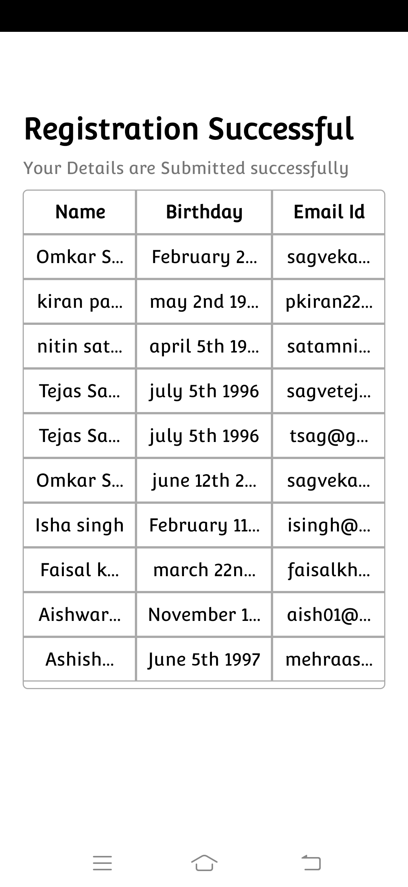

# RegistrationPage
Regisration page + SQLite + Android Studio + java 
Bonus point: In <b>UserListTable.java</b> file you can see code for how to insert data in descending order with the help of LinearLayoutManager. 
Screenshots: 

